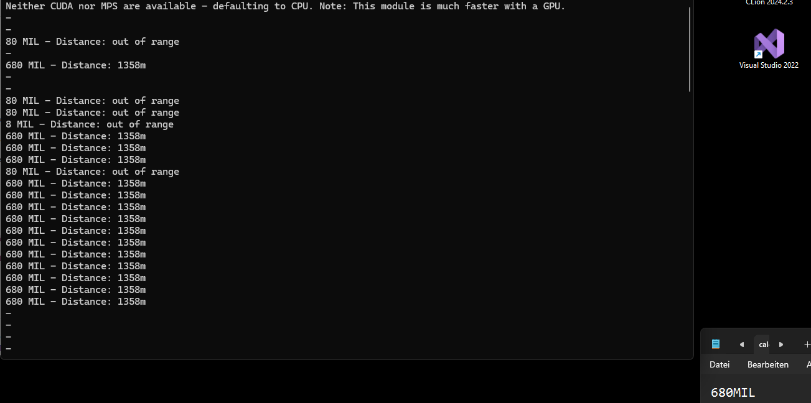

This Python script was created to automate the calculation of artillery distances in Hell Let Loose. It captures screenshots of a specific area, extracts MIL values using OCR, and calculates the corresponding distance in meters.

Usage : 
Run the script with Python:
python script_name.py
Alternatively, you can convert it to an executable using PyInstaller.

Note:
This script is still in its early stages and is not fully optimized. 
It’s a simple test to see if the concept works. Future improvements and features, including map visualization, will be added using C++ for better performance.

